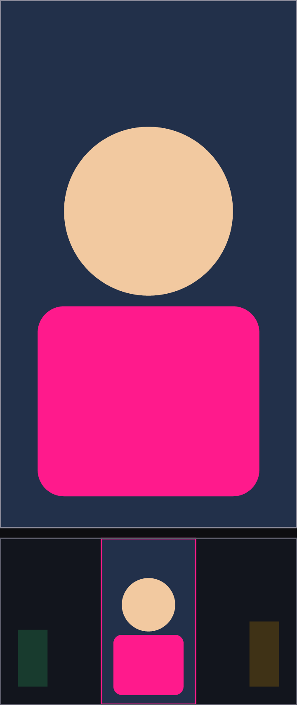
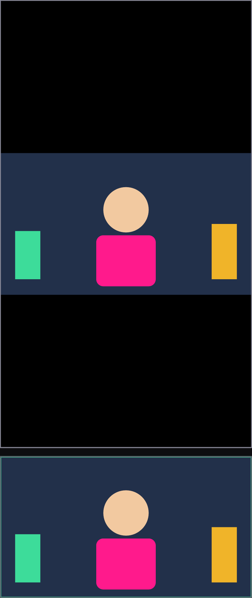

# Интервью 020 — как камера 16:9 садится в портретный холст

**Статус:** ✅ ЗАКРЫТО 2026-08-02 (В2 отвечен; В1 снят реализацией — см. заметку агента внизу) · **Заведено:** 2026-08-02 · **Кто спрашивает:** ИИ-агент
**Откуда:** вопрос жил хвостом шага S2 в `plans/04_bug29_camera_pipeline.md` — гард контура нашёл
его как потерянный вне `interviews/`; перенесён сюда по решению `interview_017` В2=(а).
**Дословно из плана:** *«камера на весь портретный кадр = кроп по бокам» ИЛИ «вписать с полями» —
УТОЧНИТЬ у Криника, но дефолт OBS = crop-to-fill; можно как трансформа слоя*.

> Камера всегда отдаёт 16:9. Когда холст сцены портретный (9:16), кадр физически не может занять его
> целиком без потерь: либо срезаем бока, либо оставляем поля. Это решение видно ЗРИТЕЛЮ в каждом
> портретном эфире, поэтому его принимаешь ты.

## Что видно на мокапах

Оба кадра — ОДНА И ТА ЖЕ сцена: ты по центру, зелёный предмет слева, жёлтый справа. Сверху —
**что увидит зритель**, снизу — **что снимает камера** (розовая/зелёная рамка = какая часть
источника попадает в эфир).

---

## В1. Что делаем по умолчанию в портретном холсте?

| # | Вариант | Что это значит на практике |
|---|---|---|
| **(а)** | Кроп в заполнение — как в OBS (**рекомендую**) | Картинка занимает весь экран зрителя, «как в тиктоке». Цена — бока сцены не видны, и в кадр надо попадать центром |
| **(б)** | Вписать с полями (letterbox) | Видно всё, что снимает камера, ничего не теряется. Цена — сверху и снизу чёрные поля на весь эфир |
| **(в)** | Кроп по умолчанию, но с ручкой у слоя: можно переключить и подвинуть | Гибко: дефолт как в (а), а нестандартную сцену ты дотягиваешь руками. Цена — ещё одна настройка в UI слоя |

**Ответ Криника:**

>

---

## В2. Если кроп — что делать с той частью, что не влезла?

| # | Вариант | Что это значит на практике |
|---|---|---|
| **(а)** | Просто центр кадра (**рекомендую**) | Предсказуемо: середина всегда в эфире. Цена — если ты сместился вбок, тебя подрежет |
| **(б)** | Позицию кропа можно двигать пальцем как трансформу слоя | Кадрируешь сцену под себя один раз. Цена — ещё один жест и ещё одно состояние в профиле сцены |

**Ответ Криника:** мы уже давным давно это решили и реализовали

_записано контуром `/owner-reviews` · by Криник · at 2026-08-02T00:46:48+03:00_

---

_Перенесено агентом из `plans/04` шаг S2 по решению `interview_017` В2=(а). Мокапы схематичны:
они показывают ГЕОМЕТРИЮ решения, а не реальный кадр._

---

## Заметка агента (2026-08-02, после ответа)

Сверился с кодом: выбирать между кропом и полями действительно НЕ НУЖНО — вопрос из `plans/04` S2
устарел. Камера рисуется СЛОЕМ в РОДНОМ аспекте источника (`CompositorVideoSource`: «Видео камеры —
в РОДНОМ аспекте источника (пилларбокс/леттербокс под квад, bug 32)»), а заполнение кадра задаёшь
ты сам трансформой слоя — масштаб, положение, снап краёв заподлицо (`StreamViewModel`). То есть в
проекте живёт вариант мощнее обоих предложенных. В `plans/04` шаг S2 помечен закрытым, вопрос
из плана убран.
