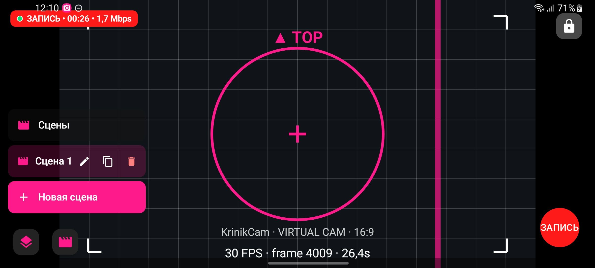
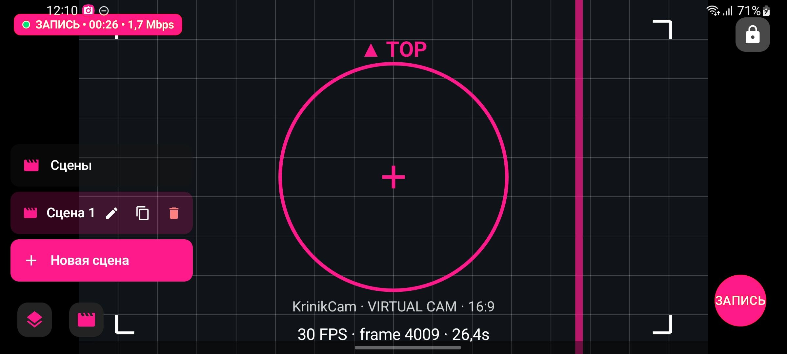
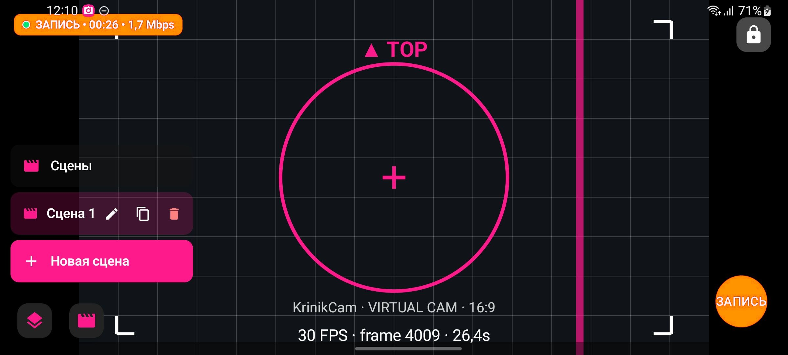
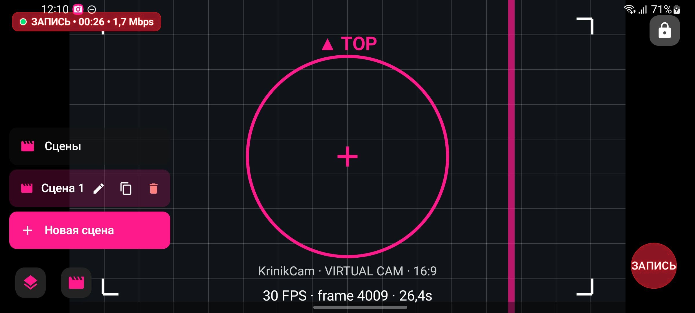

# Интервью 023 — Цвет индикации ЗАПИСИ, и нужен ли режим «запись + эфир одновременно»

**Статус:** ⏳ ЖДЁТ ОТВЕТА · **Заведено:** 2026-08-02 · **Кто спрашивает:** ИИ-агент
**Откуда:** `bugs/79` — твоё сообщение «*пишет ЭФИР, когда это не эфир, а запись в ФАЙЛ*».

## Что уже сделано (чтобы ты не отвечал на решённое)

**Подпись исправлена и принята живьём.** Кнопка больше не врёт: при записи в файл и FAB, и плашка
пишут «ЗАПИСЬ», при эфире — «ЭФИР». Причина была в том, что это решение принималось в ДВУХ местах и
только одно знало про запись; теперь место одно, и на него повешен гард, который не даст ему снова
разъехаться. Твоего решения тут не требовалось, поэтому я не стал ждать и починил.

Осталось ровно одно, чего агент решать не должен, — **цвет**. И один вопрос про фичу, которой у нас
пока нет.

---

## В1. Каким цветом показывать ЗАПИСЬ В ФАЙЛ?

Сейчас запись и эфир красятся ОДНИМ красным `#FF1A1A`. Подпись теперь честная, но цвет одинаковый —
то есть кнопка по-прежнему выглядит одинаково в двух разных режимах.

Ниже — **четыре варианта на одном и том же настоящем кадре** с телефона (идёт запись в файл).
Метки намеренно слепые: название цвета подсказывает ответ, а тут надо судить глазами. Подменён
только «эфирный красный» — превью, белый текст и зелёная точка не тронуты. Меняется И плашка слева
вверху, И круглая кнопка справа внизу — они должны говорить одно и то же.

Два факта, которые стоит знать перед выбором (это факты, не мой вердикт):

- красный — мировой стандарт кнопки записи, так что «оставить как есть» тут не лень, а рабочий вариант;
- один из вариантов — это ровно тот цвет, которым в интерфейсе уже покрашены кнопка «Новая сцена»,
  иконки панелей и сетка виртуальной камеры. Индикация в нём перестаёт выделяться на общем фоне.

| # | Вариант |
|---|---|
| **(а)** | Вариант **1** |
| **(б)** | Вариант **2** |
| **(в)** | Вариант **3** |
| **(г)** | Вариант **4** |
| **(д)** | Ни один — впиши свой цвет или скажи словами, чего хочешь |

**Ответ Криника:**

>

---

## В2. Нужен ли вообще режим «запись в файл И эфир ОДНОВРЕМЕННО»?

При заведении бага я собирался спросить тебя, что писать на кнопке, когда идут и запись, и эфир.
Полез в код — и оказалось, что **такого состояния у нас нет**: меню во время сессии показывает
только «Стоп», а движок прямо отказывается начинать запись поверх эфира. То есть я чуть не попросил
тебя придумать индикацию для несуществующего режима.

Поэтому спрашиваю честно — про саму фичу. Практический смысл у неё есть: писать локальную копию
эфира в хорошем качестве, пока в интернет уходит сжатый поток (так делают на OBS почти все).

| # | Вариант | Что это значит |
|---|---|---|
| **(а)** | Оставить как есть: одно за раз | Ничего не делаем, вопрос закрыт |
| **(б)** | Хочу, чтобы можно было писать в файл ПРЯМО ВО ВРЕМЯ эфира | Завожу отдельную задачу; там же решится и индикация, и вопрос качества локальной копии |
| **(в)** | Хочу, но не сейчас — положи в беклог | Оформлю идеей без срока |

**Ответ Криника:**

>

---

_Заведено агентом 2026-08-02. Мокапы собраны из настоящего скриншота записи на Samsung A51
(0.8 (47)) — ключ к слепым меткам лежит рядом: `assets/023_fab_variant_KEY.md`._
